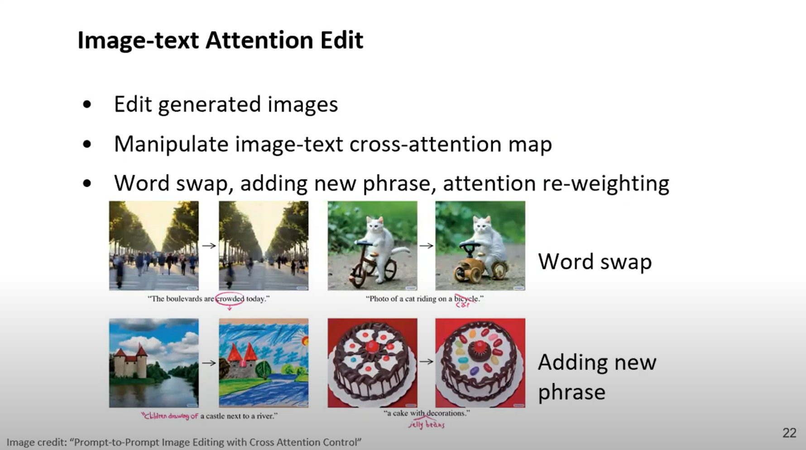

## Introduction
Greetings, I am Ye Wang, currently pursuing my doctoral studies at the School of Artificial Intelligence, Jilin University. I am in my second year, under the mentorship of Associate Professor [Rui Ma](https://ruim-jlu.github.io/), affiliated with the [ICL Group](https://ruim-jlu.github.io/team/).

## Research Focus
My research pursuits revolve around, but are not confined to:
- Image Generation
- Image Editing
- AIGC+ in the realm of Industrial Design

## Publications
<!DOCTYPE html>
<html lang="en">
<head>
  <meta charset="UTF-8">
  <title>Publications</title>
  
</head>
<body>

  

    
    

      
<a href="link_to_paper1">Paper 1 Title</a>

      
Authors: Your Name

      
Conference / Journal: Conference Name

      
Year: 2023

    

  

  

    
    

      
<a href="link_to_paper2">Paper 2 Title</a>

      
Authors: Your Name

      
Conference / Journal: Journal Name

      
Year: 2022

    

  

  

    
    

      
<a href="link_to_paper3">Paper 3 Title</a>

      
Authors: Your Name

      
Conference / Journal: Conference Name

      
Year: 2021

    

  

</body>
</html>
